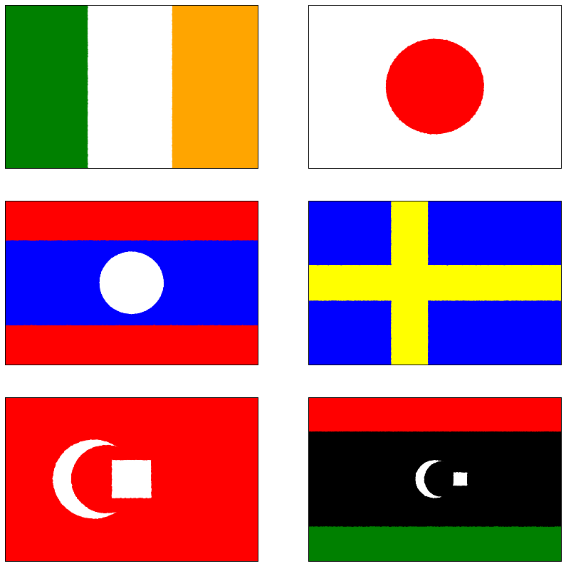
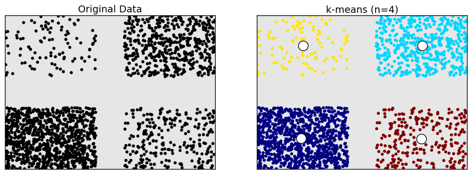
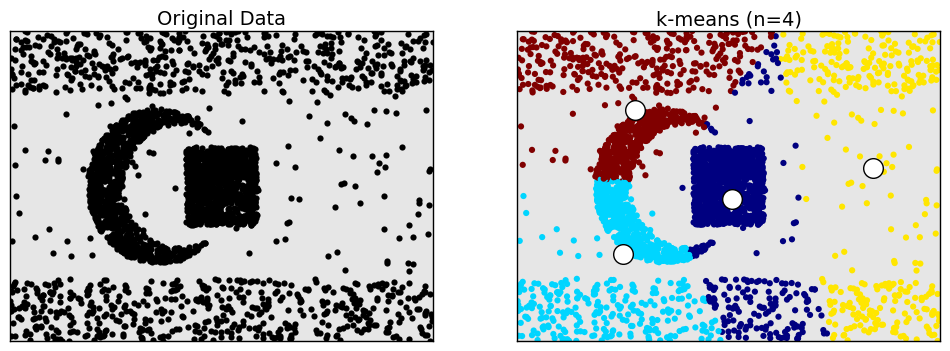
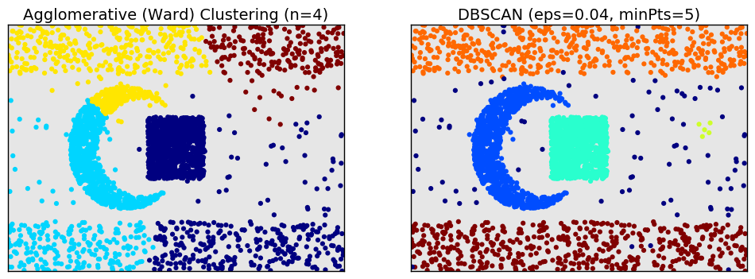
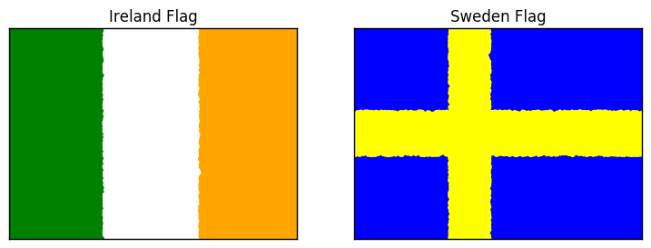
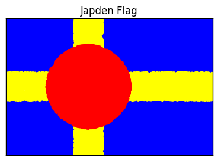
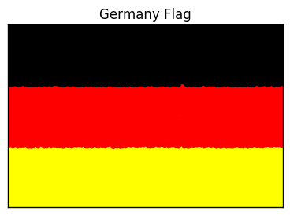

# cluster-flag

Reproduce country flags using python and pandas.

Here's a small selection of flags that can be created with ``cluster-flag`` ([python code](https://github.com/dashee87/cluster-flag/blob/master/examples/six_classic_flags.py))



## Installation

``cluster-flag`` relies on pandas and numpy, so make sure they're installed and up to date.

The stable version is on [PyPi](https://pypi.python.org/pypi/cluster-flag/0.1.2) and can be installed via pip:
```bash
$ pip install cluster-flag
```

To work off the development version, [you can clone this repo](https://help.github.com/articles/cloning-a-repository/) and install from the root folder

```bash
$ python setup.py install
```

## 3 Reasons to use cluster-flag

### 1. Unsupervised Learning with Country Flags

It's called ``cluster-flag``, as I thought flags could offer novel datasets to explore clustering algorithms. A huge range of datasets can be constructed through this package. Let's look at a few examples (the complete python code is [here](https://github.com/dashee87/cluster-flag/blob/master/examples/kmeans_hc_dbscan.py)):


```python
import pandas as pd
import numpy as np
import matplotlib.pyplot as plt
from clusterflag.country_flags import *
# load clustering algorithms
from sklearn.cluster import AgglomerativeClustering, DBSCAN, KMeans

# for reproducibility
np.random.seed(60)
# construct toy dataset based on the cross flag
dataset0 = cross_flag(npoints=[100,1000,500,250,0], colours=['']*5)
# convert pandas dataframe to numpy array (format for clustering algorithms)
np_dataset0 = dataset0[['x','y']].values
# build k-means model with 4 clusters on this dataset
d0_kmeans = KMeans(n_clusters=4).fit(np_dataset0)
# plot the output
fig, (ax1,ax2)  = plt.subplots(1,2, figsize=(12, 4), dpi=80)
ax1.set_axis_bgcolor('#e6e6e6')
ax1.set_title('Original Data',size=14)
ax1.set_xticks([])
ax1.set_yticks([])
ax1.set_ylim([0,1])
ax1.set_xlim([0,1.5])
ax1.scatter(dataset0['x'], dataset0['y'], c='black',marker='o',linewidths=0.0)
ax2.set_axis_bgcolor('#e6e6e6')
ax2.set_title('k-means (n=4)',size=14)
ax2.set_xticks([])
ax2.set_yticks([])
ax2.set_ylim([0,1])
ax2.set_xlim([0,1.5])
ax2.scatter(np_dataset0[:,0], np_dataset0[:,1], 
            c=d0_kmeans.predict(np_dataset0), marker='o', linewidths=0.0)
ax2.scatter(d0_kmeans.cluster_centers_[:,0], d0_kmeans.cluster_centers_[:,1], 
            c='white' ,marker='o', s=200)
plt.show()
```





k-means does a pretty good job on our Scandinavian flag based dataset. Let's see how it handles a crescent themed dataset.


```python
# construct toy dataset based on the crescent flag
dataset1 = crescent_flag(npoints=[1000,1000,100,500,500],rect=0.2,ratio=1.5,
                           colours=['']*5,
                           bcx=0.35, bcy=0.5, 
                           scx=0.4, scy=0.5, bradius=0.25, sradius=0.2, 
                           starcx=0.5, starcy=0.5, starrx=0.125, 
                           starry=0.125)
np_dataset1 = dataset1[['x','y']].values

# kmeans model with 4 clusters
d1_kmeans = KMeans(n_clusters=4).fit(np_dataset1)
# plot the output


```





k-means is not looking so good now. How about hierarchical clustering and DBSCAN?


```python
# hierarchical clustering (n=4) with ward linkage
d1_hc = AgglomerativeClustering(linkage='ward',
                                     n_clusters=4).fit_predict(np_dataset1)
# DBSCAN
d1_db = DBSCAN(eps=0.04, min_samples=5).fit_predict(np_dataset1)
# plot the output

```





DBSCAN is the winner!!! But it wouldn't be hard to configure an even harder dataset. The possibilities are endless!

### 2. Flags are cool

Well, I think flags are cool. It's interesting that different societies place so much importance on these geometrical abstractions. I suppose national anthems are similarly strange if you think about it, but at least they can use lyrics (unless you're Spain) to convey history and culture. Anyway, with ``cluster-flag``, you can easily reproduce all the great flags of the world (excluding those with stars and other complex shapes- i.e most flags).


```python
# simple_flag defaults to the Irish tricolour
irishFlag = simple_flag(npoints=[10000]*3)
# we need to shift the cross centre and add some colour arguments to recreate the Swedish flag
swedenFlag = cross_flag(npoints=[10000]*5, cenx=0.4, colours=['blue']*4 + ['yellow'])
# plot flags
fig, ax = plt.subplots(1,2,figsize=(9, 3))
for (pos, (flag, country)) in enumerate(zip([irishFlag,swedenFlag],['Ireland', 'Sweden'])):
    ax[pos].set_xticks([])
    ax[pos].set_yticks([])
    ax[pos].set_xlim([0,1.5])
    ax[pos].set_ylim([0,1])
    ax[pos].set_title(country + ' Flag', size=12)
    ax[pos].scatter(flag['x'], flag['y'],c=flag['flag_col'], lw=0)
plt.show()

```





You can also use ``cluster-flag`` to invent flags that really should exist. Get ready for the inevitable political union of Sweden and Japan by pledging your allegiance to the flag of Japden (aka Swepan).


```python
# the second value in the array is 0, as we don't want any background points in the Japan flag
japdenFlag = pd.concat([swedenFlag, japan_flag(npoints=[100000,0], cenx=0.4)])
plt.subplots(1,figsize=(4.5, 3))
plt.xticks([])
plt.yticks([])
plt.xlim([0,1.5])
plt.ylim([0,1])
plt.title('Japden Flag', size=12)
plt.scatter(japdenFlag['x'], japdenFlag['y'],c=japdenFlag['flag_col'], lw=0)
plt.show()
```





### 3. Learn Pandas (and Numpy) The Fun Way

Each flag is simply a graphical representation of a pandas dataframe. And each dataframe constitues a 2-D numpy array appended with a column that defines the colour of the points. So, for novice users, ``flag-cluster`` offers a intuitive context in which to learn and perfect your pandas and numpy skills.


```python
irishFlag = simple_flag(npoints=[10000]*3)
irishFlag.info()
```

    <class 'pandas.core.frame.DataFrame'>
    RangeIndex: 30000 entries, 0 to 29999
    Data columns (total 3 columns):
    x           30000 non-null float64
    y           30000 non-null float64
    flag_col    30000 non-null object
    dtypes: float64(2), object(1)
    memory usage: 703.2+ KB
    


```python
# get midpoint of each flag segment
irishFlag.groupby('flag_col', axis=0).mean()
```


<div>
<table border="1" class="dataframe">
  <thead>
    <tr style="text-align: right;">
      <th></th>
      <th>x</th>
      <th>y</th>
    </tr>
    <tr>
      <th>flag_col</th>
      <th></th>
      <th></th>
    </tr>
  </thead>
  <tbody>
    <tr>
      <th>green</th>
      <td>0.248995</td>
      <td>0.501111</td>
    </tr>
    <tr>
      <th>orange</th>
      <td>1.249278</td>
      <td>0.496614</td>
    </tr>
    <tr>
      <th>white</th>
      <td>0.751620</td>
      <td>0.498237</td>
    </tr>
  </tbody>
</table>
</div>


```python
# change Ireland flag to Germany flag using pandas methods
irishFlag.set_value(irishFlag['flag_col']=='green','flag_col','yellow')
irishFlag.set_value(irishFlag['flag_col']=='white','flag_col','red')
irishFlag.set_value(irishFlag['flag_col']=='orange','flag_col','black')
irishFlag['x'] /= 1.5
irishFlag['y'] *= 1.5
plt.subplots(1,figsize=(4.5, 3))
plt.xticks([])
plt.yticks([])
plt.xlim([0,1.5])
plt.ylim([0,1])
plt.title('Germany Flag', size=12)
plt.scatter(irishFlag['y'], irishFlag['x'],c=irishFlag['flag_col'], lw=0)
plt.show()
```





## Want to contribute to cluster-flag?

Whether it's a bug fix, new flag or an angry comment telling me how insulting it is to have the star on your national flag replaced with a rectangle, contributions are appreciated. Just follow the guidelines [here](https://github.com/dashee87/cluster-flag/blob/master/CONTRIBUTING.md).
